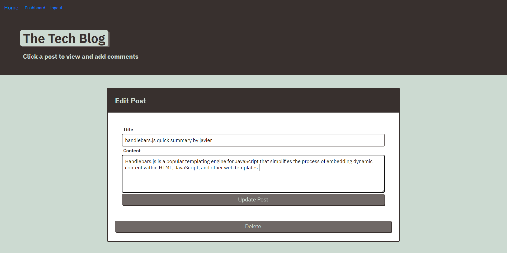

# Tech-Blog

## Description
Blog where developers can publish their posts and comment on other developers’ posts Uses Handlebars.js as the templating language, Sequelize as the ORM, and the express-session npm package for authentication. Data is stored/retrieved from a MySQL database.
## Link to website
https://javierburgara.github.io/Model-View-Controller-MVC-Challenge-Tech-Blog/
## Screenshot

## Table of Contents
* [Description](#description)
* [Installation](#installation)
* [Languages & Dependencies](#languagesanddependencies)
* [Questions](#questions)
*[Contact-Me](#contact-me)
## Installation
to start the server.js, you want to open up your terminal and do a npm command which is npm i. After that you npm start and the website would be launch in your local browser http://localhost:3006/. Make sure to use Username: Javier and Password:12345678 to sign in.
## Languages & Dependencies
Node.js, Handlebars.js, JavaScript, npm install, npm i express-handlebars, npm i mysql2, npm i sequelize, npm i dotenv, npm i bcrypt, npm i express-session, npm i connect-session-sequelize
## Contact-Me
  * Name - JavierBurgara
  * Email - Javierburgara150@yahoo.com
  * Github - [JavierBurgara](https://github.com/JavierBurgara/)
## Questions
Please send your questions [here](mailto:Javierburgara150@yahoo.com?subject=[GitHub]%20Dev%20Connect) or visit [github/JavierBurgara](https://github.com/JavierBurgara).